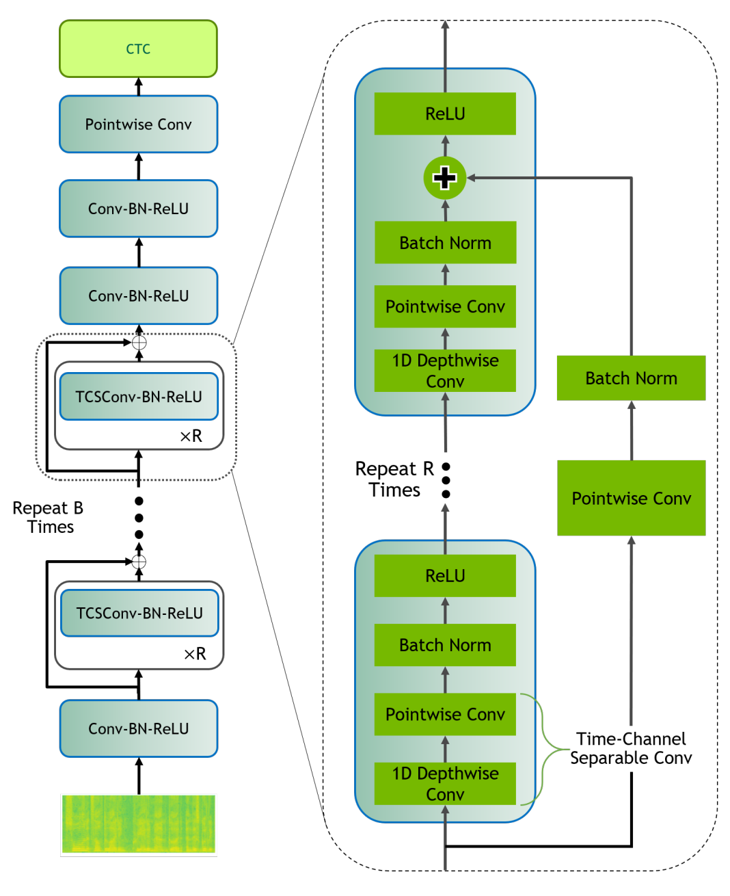

# Automatic Speech Recognition

Implementation of models for the Automatic Speech Recognition problem.

1. [QuartzNet](https://arxiv.org/abs/1910.10261) with (BxS)xR architecture:

<p>
    
</p>

2. [Deepspeech]():

<p>
    
</p>

## Notebook

[](https://colab.research.google.com/github/khaykingleb/Stock-Price-Forecasting/blob/main/scripts/main.ipynb)

## Getting Started 

Clone the repository and step into it:
```shell
git clone https://github.com/khaykingleb/ASR.git
cd ASR
```

Install requirements and modules.
```shell
pip install -r requirements.txt
python setup.py install
```

Use for model training:
```shell
python train.py -c configs/cofig_name.json
```

Use for model testing:
```shell
python test.py \
      -c default_test_model/config.json \
      -r default_test_model/checkpoint.pth \
      -t test_data \
      -o result.json
```

## Data Used

* [Mozilla Common Voice](https://commonvoice.mozilla.org/).
* [LJ Speech](https://keithito.com/LJ-Speech-Dataset/).
* [Librispeech](https://paperswithcode.com/dataset/librispeech).